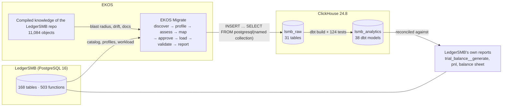

# 01 — LedgerSMB analytics on ClickHouse: overview

> **Status:** demo, fully reproducible (`pipelines/lsmb_pipelines/run.py`).
> **Data:** **synthetic.** *Harbor Mill Supply Co.* is a simulated industrial-components distributor.
> Its 18 months of activity are generated into LedgerSMB's **real** schema and posted through
> LedgerSMB's **own** stored procedures (FIFO COGS, payments, chart of accounts). No real company's
> data is involved.

## What this is

An end-to-end, evidence-backed migration of an open-source ERP (LedgerSMB — Perl + PostgreSQL,
double-entry accounting with inventory) into an analytical layer on ClickHouse. It covers:

| Layer | Built with | Where |
|---|---|---|
| Understanding the source | **EKOS**: compiled knowledge of LedgerSMB's code, SQL and docs | `logs/ekos_queries.jsonl` |
| Moving the data | **EKOS Migrate** (RFC 0154–0162): discover, profile, assess, map, approve, load, validate | `migration/`, `logs/migration.log` |
| Analytical model | **dbt** on ClickHouse: 12 staging views, 4 intermediate tables, 22 marts | `dbt/` |
| Orchestration, reconciliation, reporting | **Python** | `pipelines/` |
| Documentation | EKOS-sourced dbt docs, these pages, the presentation | `docs/`, `presentation/` |

## Architecture

## The business questions it answers

**Finance.** Monthly trial balance, P&L and balance sheet (always balanced, and tested). Receivables
and payables aging, direct cash flow, and DSO / DPO / DIO.

**Product and materials.** Revenue and FIFO margin by product group and part, customer profitability
and payment behaviour, inventory position and days of supply, reorder alerts, stock-count shrinkage,
order backlog, ABC classification, and supplier spend.

## Headline results of the official run

| | |
|---|---|
| Tables migrated | 31 (30 by EKOS Migrate, 1 by Python with a recorded decision) |
| Validation | **30/30 pass V1 + V2 + V3** (row counts, per-column aggregates, bucketed row hashes) |
| Risk-gated loads | 8 units computed R3 by EKOS → human approval required; **self-approval refused 8/8** |
| dbt | **162/162** pass (38 models, 124 tests) |
| Independent reconciliation | **6/6** checks vs LedgerSMB's own reports, to the cent |
| EKOS defects found and fixed | **16** (devlog_226), incl. a self-approval bypass, a cents-blind validator and two risk-gate holes |
| End-to-end runtime | ≈ 5 minutes from an empty database |

See [05 — Key figures](05-kpis.md) for the numbers and [08 — Decisions and findings](08-decisions-and-findings.md)
for everything that did not go to plan.
