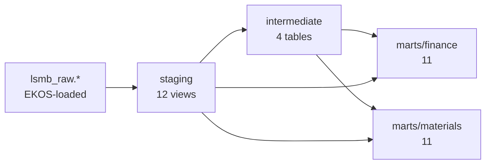

# 04 — The analytical model (dbt on ClickHouse)

Project `dbt/` (`lsmb_analytics`), dbt-core 1.10 + dbt-clickhouse 1.10. Database `lsmb_analytics`.
Build: `dbt build` = 38 models + 124 tests. The session sets `join_use_nulls = 1`, so every LEFT JOIN
has standard SQL semantics (NULL, not a type default).

## Layers

| Layer | Purpose | Materialization |
|---|---|---|
| staging | 1:1 with a source table: renamed, typed, cents-exact decimals, **debit/credit split from LedgerSMB's signed amount** | view |
| intermediate | business joins done once: journal lines + accounts + transaction types, sales lines + FIFO COGS, open-item balances | table |
| marts | star-schema facts and dimensions, plus report-shaped marts | table |

## Models

**Staging:** `stg_lsmb__accounts`, `__journal_lines`, `__transactions`, `__ar_invoices`,
`__ap_invoices`, `__invoice_lines`, `__parts`, `__counterparties`, `__payments`, `__sales_orders`,
`__order_lines`, `__inventory_counts`.

**Intermediate:** `int_journal_lines_enriched` (with `natural_amount`, the effect on the account's
natural balance), `int_sales_lines` (revenue and **exact FIFO COGS per line**, joined through the
invoice-line tag LedgerSMB puts on COGS journal lines), `int_purchase_lines`,
`int_open_item_balances` (outstanding per AR/AP open item as of `var('as_of_date')`).

**Finance marts**

| Model | Grain | Answers |
|---|---|---|
| `fct_journal_lines` | journal line | everything financial aggregates from here |
| `dim_account`, `dim_counterparty`, `dim_date` | account / counterparty / day | conformed dimensions |
| `mart_trial_balance_monthly` | account × month | opening, debits, credits, closing, natural sign, zero rows included |
| `mart_income_statement_monthly` | month | revenue, COGS, gross margin %, payroll, G&A, net income |
| `mart_balance_sheet_monthly` | month-end | assets = liabilities + equity (earnings to date shown explicitly) |
| `mart_ar_aging`, `mart_ap_aging` | customer / vendor | not due, 1–30, 31–60, 61–90, 90+ |
| `mart_cash_flow_monthly` | month | direct-method cash flow by counterpart |
| `mart_working_capital_monthly` | month | DSO, DPO, DIO |

**Product and materials marts**

| Model | Grain | Answers |
|---|---|---|
| `fct_sales_lines`, `fct_purchase_lines`, `dim_part` | line / part | the materials facts |
| `mart_sales_by_part_group_monthly` | group × month | volume, revenue, FIFO COGS, margin % |
| `mart_customer_profitability` | customer | revenue, margin, average days to pay, open AR, rank |
| `mart_inventory_movements_monthly` | part × month | received, sold, adjusted, running on-hand |
| `mart_inventory_position` | part | value, 90-day usage, days of supply, below reorder point |
| `mart_stock_count_variance` | count × group | shrinkage in units and value |
| `mart_order_backlog` | open order | value, age, lateness |
| `mart_abc_analysis` | part | A / B / C by trailing-12-month revenue |
| `mart_supplier_spend_monthly` | vendor × month | spend, invoices, distinct parts |

## Conventions

* Amounts are `Decimal64(2)` in staging and later, and `Decimal128(22)` only in `lsmb_raw`, where
  EKOS sized it from the measured data. LedgerSMB's `payment_post()` stores unrounded products, so
  scale 22 is real in the source.
* Account numbers the marts depend on are dbt **vars** (`acc_ar: "1200"`, …), not literals in SQL.
* Every model and every key column has a description; the 31 sources carry **LedgerSMB's own
  `COMMENT ON` text, pulled through EKOS with file citations** (`pipelines/docs/gen_dbt_sources.py`).
  46 of 303 deployed columns have such a comment; the other 257 say so plainly rather than inventing
  one.
* Output aliases never reuse a column name inside the same aggregation. ClickHouse lets an alias
  shadow a column, and `sum(revenue) AS revenue` reused later nests one aggregate inside another.

## dbt docs

`dbt docs generate` produces the catalog and lineage graph in `dbt/target/` (`index.html`,
`catalog.json`, `manifest.json`). Serve it with `dbt docs serve --profiles-dir .`.
